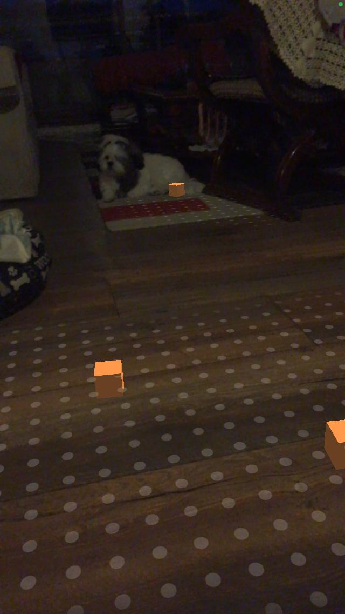
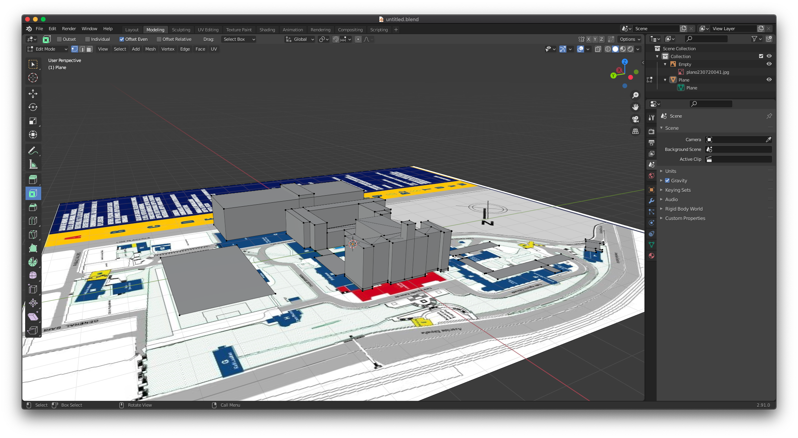
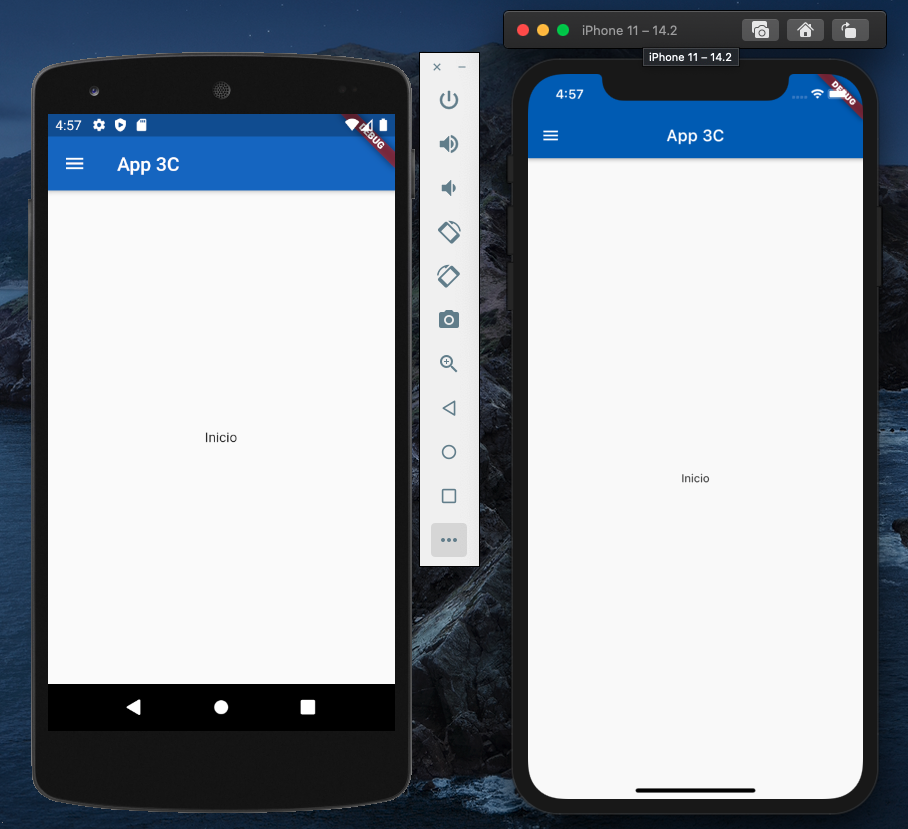
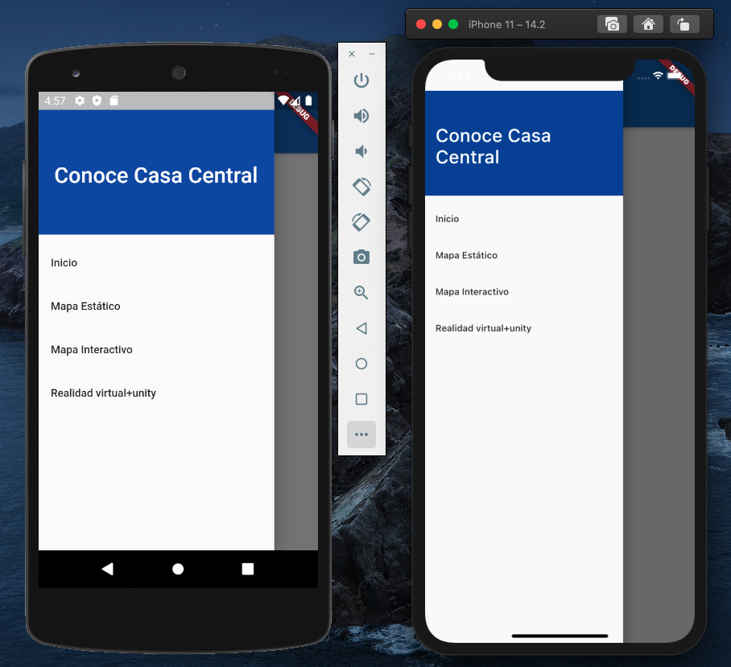

## App 3C - IWG-101

Estudiantes: Ignacio Arcos, Jorge Orellana, Rolando Rojas.

 

### Avances elementos de la app (_12 de diciembre de 2020_)

Dada la cercanía del segundo avance, creemos que es relevante dar a conocer como va avanzando el proceso de los distintos elementos que se están desarrollando en Unity, y que posteriormente serán integrados a la interfaz que fué dada a conocer en el post anterior.

**_Parte 1:_**
.png)
.png)
.png)

 

**_Parte 2:_**

 

**_Parte 3: Realidad Aumentada_**
Para esta sección de la app, ya se está en un estado funcional, donde esta ya ha sido probada individualmente en un dispositivo iOS, sin embargo, falta hacer el modelo final que estará en la app, que se está realizando en Blender, y que posteriormente será importado a Unity.

Screenshot (14).pngS2f2.jpeg)

 

### Avances interfaz usuaria (_25 de Noviembre de 2020_)

Se logró realizar una interfaz de usuario funcional con varias pestañas que van a tener los distintos contenidos que iremos implementando en la app, todo esto se logró realizar con Dart, el lenguaje por defecto que ocupa Flutter. 

 

 

### Planificación para las siguientes semanas (_21 de Noviembre de 2020_)

_Semana del 23 al 29 de Noviembre_: Realización de la interfaz usuaria dentro de la aplicación en Flutter

_Semana 30 al 6 de Diciembre_: Fase "beta" de mapa estático y dinámico

_Semana del 7 al 13 de Diciembre_: Mapa estático finalizado

_Semana del 14 al 18 de Diciembre_: Finalización de la app
 
 

### Estableciendo funcionalidades del proyecto (_18 de Noviembre de 2020_)

En primer lugar, decidimos que la tecnología a utilizar para realizar nuestra aplicación móvil será Flutter, pero además para lograr ciertas funcionalidades que pondremos más adelante, también integraremos Unity dentro de nuestra app.

**Funcionalidades:**

Mapa 3d que nos permita tener una vista general de la universidad

Utilizaremos realidad aumentada para generar una manera llamativa y dinamica que nos permita recorrer la universidad

Mapa estatico que  nos permita conocer la universidad sin recurrir al mapa interactivo

Se utilizara flutter + unity para desarrollar una mejor experiencia para el usuario con la ventaja de poder utilizarla en cualquier dispositivo movil

Interaccion con objetos lo que nos permitira conocer de mejor manera el establecimiento

 
 

### 3C USM (_7 de Noviembre de 2020_)
**_Tipo de aplicación: móvil_**

**Problemática abordada**

Las personas recién egresadas de la educación media puede que se encuentren con dificultades para encontrar toda la información necesaria para hacer su decisión de entrar a una universidad, aunque muchas de estás páginas contienen la información, pareciera que esta se esconde de nosotros.
Nuestra aplicación pretende reunir toda esta información y ponerla en un lugar de fácil y rápido acceso, tanto como para alumnos que pretenden unirse a la UTFSM, y aquellos alumnos que ya llevan tiempo en ella.
Además, la casa central se caracteriza por su enorme tamaño, incluso haciendo que profesores y alumnos antiguos, a veces, se desorienten. Ahora imaginemos que un alumno recién ingresado está intentando llegar a la biblióteca, ¿por donde empieza a buscar?.

**Interacción**

(_Idea principal, puede ser cambiada más adelante_)

El usuario se encontrará con una aplicación donde la interacción con la persona se llevará a cabo a través de un menú que permita la elección de visualización de mapa, en el que se mostrará la información.
(_Apartado sujeto a cambios drásticos_)

En uno de estos apartados se encontrará la sección de mapa, donde el usuario podrá ver como llegar a la universidad, como moverse a través de ella (Por ejemplo, como llegar al casino).

**Información**

La información será recopilada por nosotros, desde distintas páginas de la UTSFM, si es necesario esta se irá actualizando.

**API**

Se utilizará una API de geolocalización llamada "_places API"_, una API desarrollada por google, que permite usar sus mapas y funciones, como StreetView.

**Aplicaciones similares**

Lo más cercano a esta app es google maps, pero este no aborda completamente el campus y da una visión demasiado general de la universidad.

**Características**

Una aplicación en donde se tiene fácil y rápido acceso a distintos tipos de información, que permita conocer el campus sin la necesidad de estar presencialemnte, y que permita la interacción del usuario para poder moverse alrededor de la universidad de manera llamativa.

 
 

### Presentación (_30 de Octubre de 2020_)

En primer lugar, nos presentaremos. Somos un grupo de estudiantes de la UTFSM de Valparaíso que, ante la experiencia que tuvimos en este año, deseamos desarrollar una aplicación móvil para facilitar la comunicación de información relevante a estudiantes que están próximos a ingresar, o que recientemente se han incorporado a la Universidad en su primer año. Nuestra motivación para esto son las ganas de mejorar algo que en el inicio del año universitario para nosotros hizo bastante falta, que fue la falta de información.
Este proyecto busca crear una aplicación móvil que facilite la vida del estudiante en el ámbito universitario, con funcionalidades que nos permitan optimizar el manejo entre paginas universitarias, proporcionarnos información necesaria y permitirnos una mejor organización.

A continuación está el punteo de ideas, y las selecciones que tuvimos en las distintas reuniones que tuvimos como grupo: (Entre corchetes están las que fueron electas, si corresponde)

**Ideas de proyecto (en general):**

[App de información y utilidades para estudiantes de primer año (Electa)]

App estilo cuestionario para estudiar ramos como progra 

Mapa en 3d de la universidad en algún motor como Unity o UE.

**¿Posibles secciones y utilidades para la app? (sujetos a modificaciones)**

Links útiles, guías de uso y consejos esenciales: Aula, Siga, Cuentas USM para Drive, Microsoft 365 e instalación de Office, entre otros.

Informaciones sobre matrículas, becas (fechas, etc), intensivos, etc

Calendario, notas(para poner correos,paralelos,horario)

Ramos, y sección para llevar cuenta de las notas de estos

Mapa de la universidad (también enlace a ubicación de la universidad en Google Maps)

**¿Lenguaje? ¿En qué hacemos la app?**

[Flutter (dart) (Nos hemos inclinado por esta opción, por su carácter multiplataforma)]

Java (solo para android)

¿Swift? (solo para iphone)

React Native

**Diseño y estructura de la app (Si es flutter):**

Material Design

Menú lateral para cambiar de secciones

